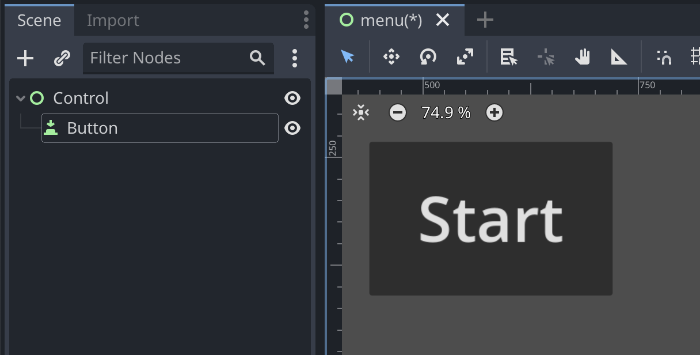
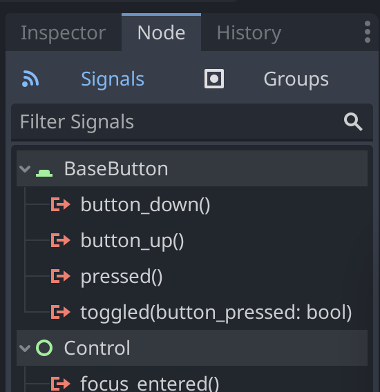
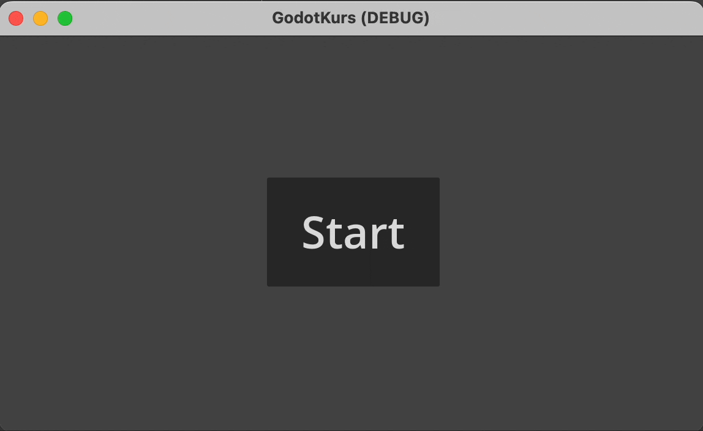

I godot kan vi bruke signaler for å trigge kode til å kjøre.



Her har vi en knapp som vi ønsker at skal starte spillet når den blir trykket på. Først av alt må vi legge til et script til Button.
Så klikker vi på node fanen, ved siden av inspector. Det kan hende du må klikke på button igjen. Her ser vi alle signalene som denne noden kan sende. på toppen av listen vises de signalene som er mest unike for den valgte noden.



Velg pressed() og trykk connect, eller dobbeltklikk på pressed().


Du kan koble et signal til alle noder i senen som har et script koblet til seg. Her skal vi koble signalet til Button sitt script. Noden som sender signalet er markert med blå tekst, det er ingenting i veien for at en node kan sende signal til sitt eget script.
Nå skal denne koden ha dukket opp i button scriptet:
```gdscript
func _on_pressed():
  pass
```
Alt du skriver i denne funksjonen kjører hver gang du trykker på knappen. I dette tilfellet ønsker vi å bytte sene, så da kan vi skrive:
func _on_pressed():
```gdscript
  get_tree().change_scene_to_file("res://Platformer/level1.tscn")
```

Denne laster inn level1.tscn som ligger i mappen Platformer



