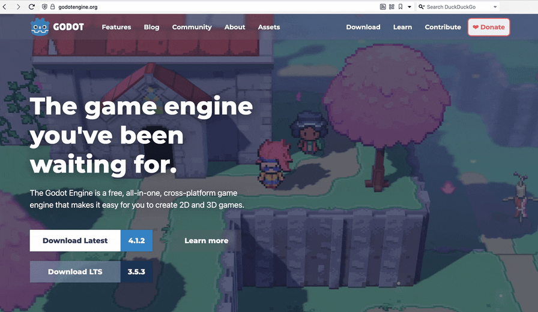
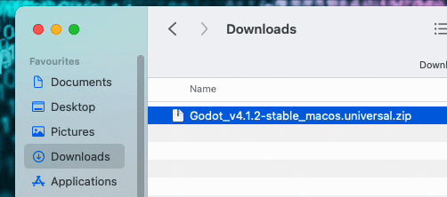

**Velg en metode å installere på.**  
**OBS!** Ikke oppdater Godot når du er midt i et prosjekt – dette kan føre til ekstra arbeid. Om du jobber i en gruppe, kan dere bruke ulike operativsystemer, så lenge alle har samme versjon av Godot installert.

- [Installer på Linux](#linux)
- [Installer på Mac](#mac)
- [Andre metoder](#andre-metoder)

---

## Linux

### Metode 1: Installer fra nettside

Gå til [https://godotengine.org/](https://godotengine.org/) og last ned ønsket version.


Pakk ut **.zip**-filen. Godot kan kjøres fra hvor som helst, så legg den et sted som passer for å holde maskinen ryddig.

### Metode 2: Installer via en pakkebehandler

Godot er også tilgjengelig i en rekke pakkebrønner. Bare pass på at du laster ned riktig versjon.

---

## Mac

### Metode 1: Installer fra nettside

Gå til [https://godotengine.org/](https://godotengine.org/) og last ned ønsket version.



Pakk ut **.zip**-filen og dra **Godot.app** til **Applications-mappen**. Eventuelt, hvis du ikke har admin-privilegier, kan du også kjøre Godot ved å dobbeltklikke på **Godot.app**.



### Metode 2: Installer via Homebrew i terminal

Dersom du har [Homebrew](https://brew.sh) installert, kan du skrive denne kommandoen i terminalen for å installere:

```sh
brew install godot
```

 

---

## Andre metoder

Du kan laste ned Godot fra [Steam](https://store.steampowered.com/app/404790/Godot_Engine/), men dette er ikke anbefalt, ettersom du har mindre kontroll over når oppdateringer installeres.

Du kan også kjøre Godot direkte i [nettleseren](https://editor.godotengine.org/releases/latest/). Dette er kun en *preview* og er ikke helt stabil, så denne metoden anbefales ikke for bruk i et prosjekt.