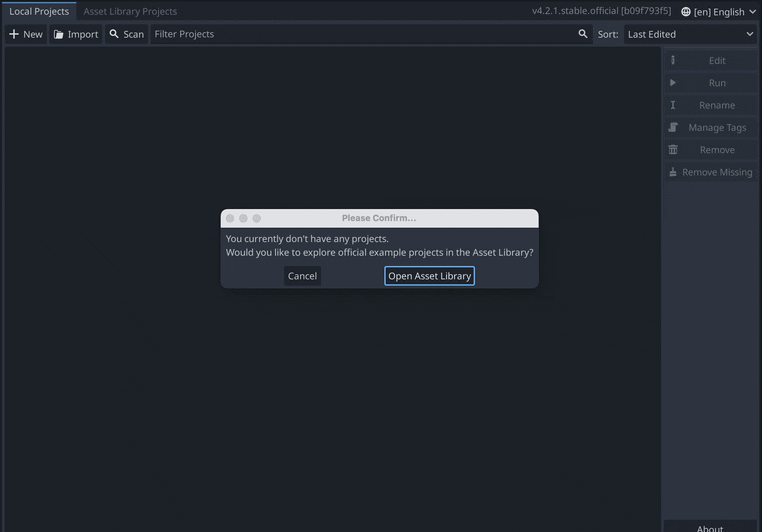
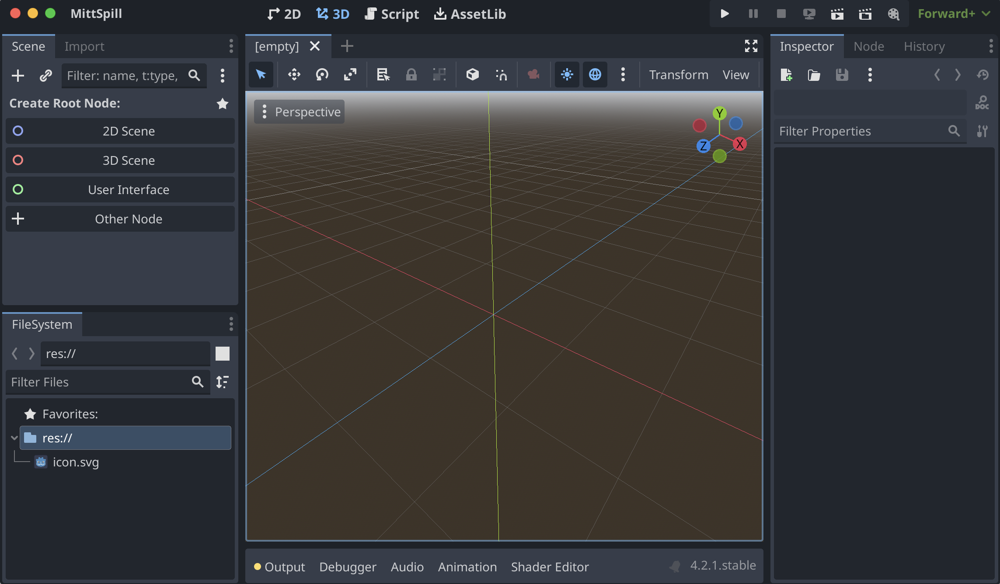

Første gang du starter Godot blir du spurt om du vil åpne *Asset Library* – avbryt dette. Klikk deretter på knappen øverst til venstre, **+ New**. Velg mappen du vil lagre prosjektet i, skriv inn prosjektnavnet, trykk på **Create Folder**, og til slutt **Create & Edit**.

*Dersom du allerede har et prosjekt som ikke vises, kan du klikke på __Import__ og bla deg frem til der du har det lagret.*

Nå vil du se dette vinduet:

Øverst til venstre ser du **Scene**-vinduet. Her vil du etter hvert se alle nodene som ligger i scenen du jobber på.

Nede til venstre finner du **FileSystem**. Her vises alle prosjektfilene dine – altså alle filer som ligger i samme mappe som prosjektet.

Helt til høyre ser du **Inspector**. Her vises alle egenskapene du kan endre på når du har valgt en node, for eksempel posisjon, størrelse, hvilken tekstur den bruker, hvilken lyd den spiller av osv.

I midten ser du viewporten din. Foreløpig viser den en tom 3D-scene. Du kan bytte mellom ulike visninger med knappene øverst i Godot-vinduet: **2D**, **3D** og **Script**. På toppen av viewporten er det en rad med verktøy. Denne er dynamisk, slik at verktøyene byttes ut basert på hva du gjør. Animasjonen viser de du kommer til å bruke mest:

Legg merke til at noden som heter **"Icon"** blir valgt. Det er noden som er valgt i **Scene**-vinduet som påvirkes av verktøyene.

For å navigere i viewporten kan du klikke med musehjulet og dra eller holde inne **mellomromstasten** og dra. Hvis du bruker en touchpad, kan du dra med to fingre.

Den tynne blå ruten du ser, er spillets "kamera" – alt spilleren skal se, må være innenfor denne ruten.
