# Introduksjon til noder i Godot

Scener i Godot er bygd opp av noder i en trestruktur. Noder er objekter med en rekke attributter. Det finnes hundrevis av forskjellige noder, og du kan definere dine egne typer, men dette skal vi se på senere. Den første *noden* i en scene kalles **root node**, og alle andre noder i scenen stammer fra den. Så før du kan gjøre noe som helst med scenen din, må du opprette en **root node**.

Vi begynner vanligvis med en av de grunnleggende nodene som Godot foreslår når vi åpner en tom scene.

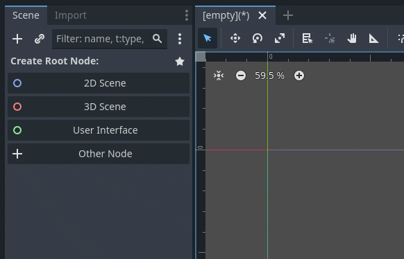

Om vi nå tar en titt i inspektøren på høyre side, kan vi se attributtene til `Node2D`. *Om du ikke ser noe her, klikk på `Node2D` i scenelisten for å velge den.* `Node2D` er kun et punkt, med de mest grunnleggende attributtene som alle 2D-noder har: **Posisjon**, **Rotasjon**, **Størrelse** og **Skew**. Siden `Node2D` kun er et punkt og ikke har noen form, er det foreløpig kun posisjon og rotasjon som gir synlige endringer.

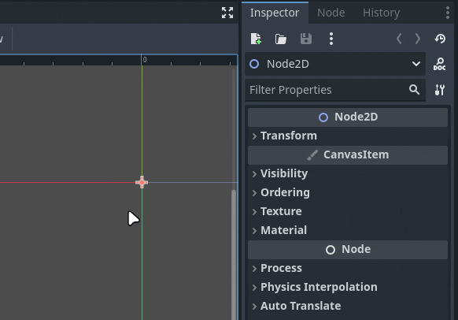

Hver gang du endrer på attributter, vil du se at det dukker opp en rund pil ⟲. Klikk på denne for å sette verdiene tilbake til standard.

## Legge til en Sprite2D-node

Nå skal vi legge til en **Sprite2D**-node. Klikk på **+** øverst i venstre hjørne av scenepanelet, finn `Sprite2D` i listen og klikk på **Create**. Nå har du en tom `Sprite2D`, og vi kan umiddelbart gi den en *tekstur* for å gjøre den synlig. Klikk i feltet hvor det står *<empty>* ved siden av *Texture*, velg *Quick Load...* nederst i listen, og velg *icon.svg*.

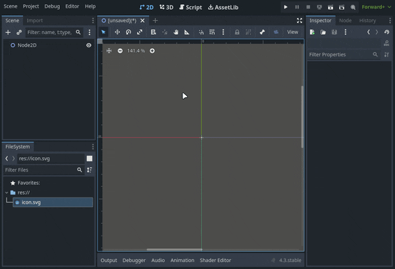

Om vi ser på inspektøren mens `Sprite2D` er valgt, legger vi merke til at den har `Transform` *(posisjon, rotasjon, etc.)*, akkurat som `Node2D`, men i tillegg har den flere attributter som er unike for `Sprite2D`: **Texture**, **Offset**, **Animation** og **Region**.

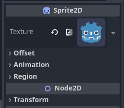

*Tips:* Alle noder med **blå** ikoner er 2D-noder, som alle bygger på `Node2D`. Det finnes også:

- **Røde** ikoner: 3D-noder  
- **Grønne** ikoner: GUI-noder  
- **Hvite** ikoner: Spesialnoder  
- Noen noder har flerfargede ikoner, noe som betyr at de kan brukes både i 2D, 3D eller flere kontekster.

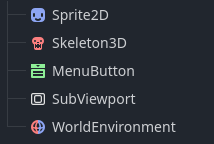

## Arv

Nå skal vi bruke *Move Mode* til å flytte litt på nodene våre.

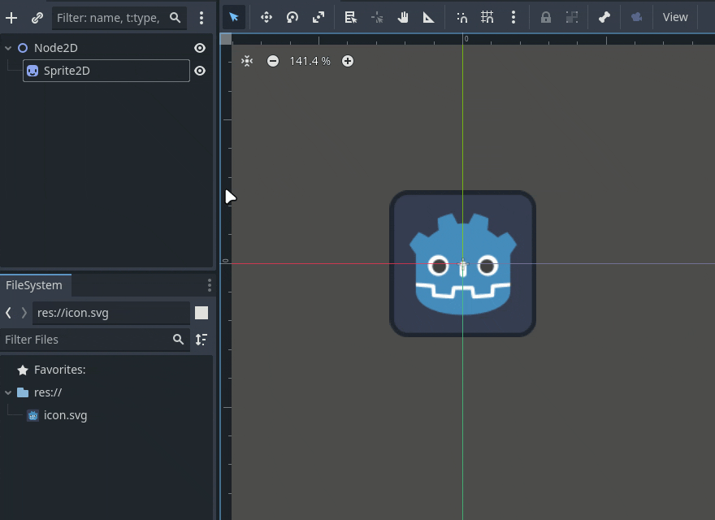

Legg merke til at når vi flytter `Node2D`, følger `Sprite2D` med. Men når vi flytter `Sprite2D`, forblir `Node2D` på plass. Dette skyldes **arv** – en node arver attributtene fra noden den ligger under.

*Tenk deg at vi lager en planet og plasserer en person på den. Når vi flytter planeten, blir personen med, men personen kan bevege seg uten at planeten følger etter.*

Vi kan se hvilke noder som arver fra andre ved å se på linjen til venstre for noden i scenelisten. Her ser vi at `Sprite2D` peker opp på `Node2D`.

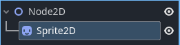

Arv gjelder også størrelse. Hvis vi skalerer `Node2D`, blir alle noder under den også større.

## Lagre og kjøre scenen

Over viewporten finner vi fanene for åpne scener. Her ser vi scenen vi har jobbet på. Den heter *[unsaved]* fordi vi ikke har lagret den ennå. Symbolet _(*)_ betyr at vi har ulagrede endringer.

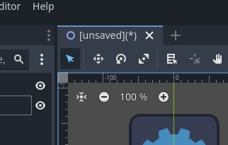

For å lagre scenen går du til *Scene > Save Scene*, eller bruk **Ctrl+S**.

Gi scenen et navn – hvis ikke, får den navnet til den første noden i scenen, noe som kan bli rotete i lengden.

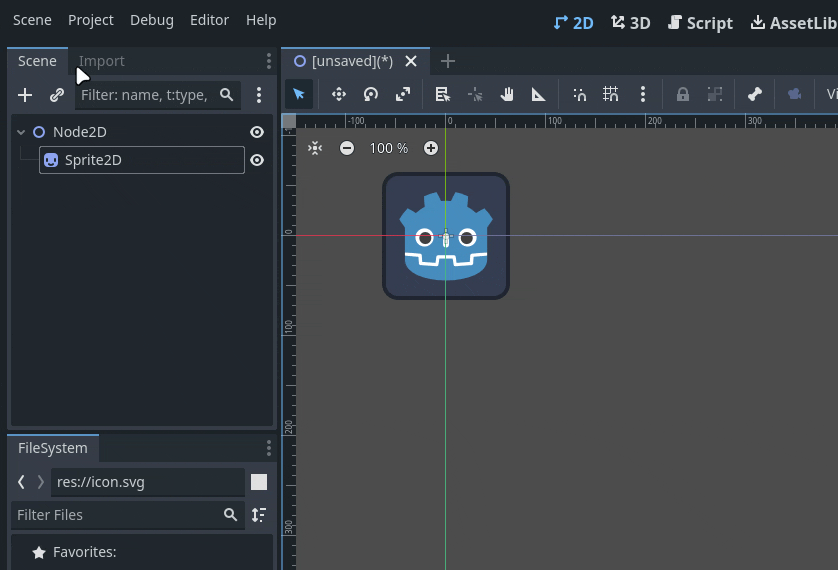

Når scenen er lagret, vil den vises blant prosjektfilene våre. Høyreklikk på den og velg *Set as Main Scene*. Du kan kun ha én **Main Scene** i prosjektet ditt – dette er scenen spillet starter med.

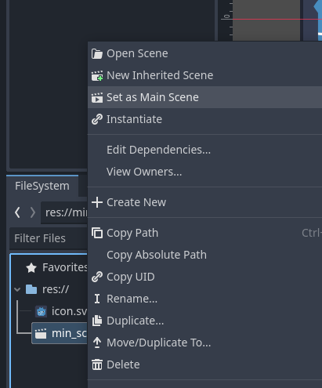

Nå kan vi klikke på **Run Project** ► øverst til høyre.

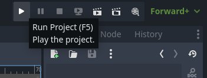

Da får vi opp et vindu som vil se omtrent slik ut – dette er spillet vårt i kjøring.

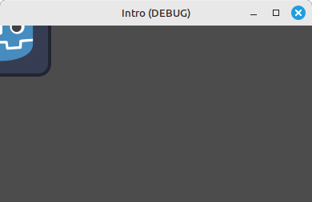

Husk at koordinatene **X = 0** og **Y = 0** er øverst til venstre i vinduet. Det spilleren skal se, må være innenfor den blå firkanten i viewporten.
