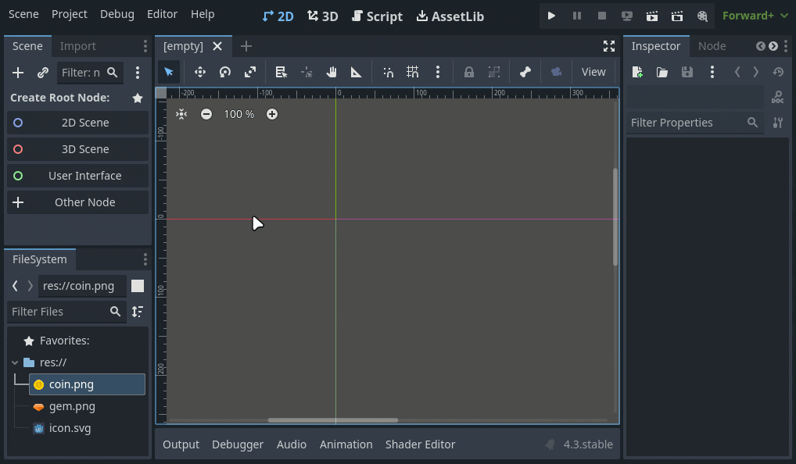
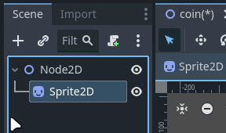
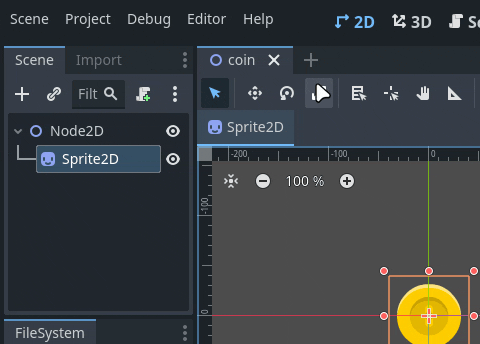
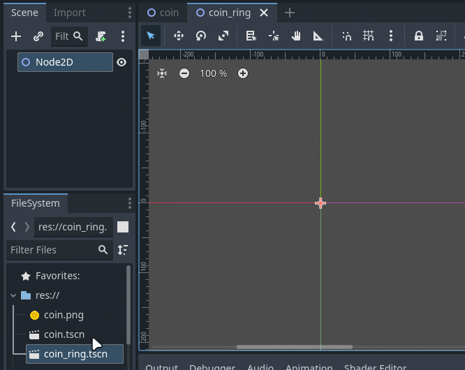
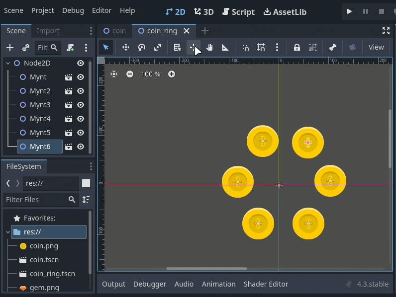
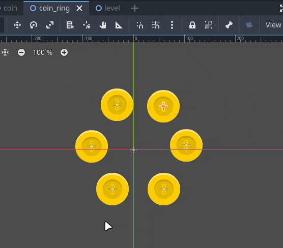
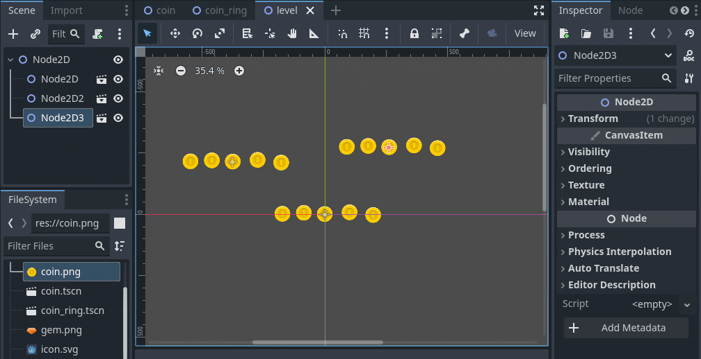

Her skal vi se på fordelen av å kunne legge inn scener i andre scener som en node. Om du ønsker å følge med steg for steg så bruker vi disse to assetene fra [kenney.nl](https://kenney.nl/assets/platformer-pack-redux):  
 

1.[Oppsett](#oppsett)

2.[Gjennbruk](#gjennbruk)

3.[Modifisering](#modifisering)

3.[Oppsummering](#oppsummering)

## Oppsett

Vi starter med å lage en tom 2D scene og legger inn en Sprite2D med myntgrafikken. Så lagrer vi scenen og kaller den for coin.tscn

Vi gir "rot noden" navnet *mynt* og passer på å lagre endringene. Husk at `(*)` betyr at vi har ulagrede endringer.

Så lager vi en ny scene ved å klikke på `+` i faneområdet, legger til en Node2D og lagrer scenen som *coin_ring.tscn*

Nå kan vi dra mynt scenen vi lagde (coin.tscn) inn i vår nye scene. Legg merke til at det ikke er myntgrafikken (coin.png) vi drar inn i scenen.

I Scene-panelet vil du se at den fylles opp med noder som heter MyntX, det betyr at når vi importerer en scene til en annen scene, så vil den noden få navnet til rot-noden sin, og ikke filnavnet til scenen. *(Husk, vi kalte rot-noden for `Mynt` og scenen for `Coin`)*.
 
🎬 symbolet betyr at noden er en scene, du kan klikke på dette symbolet for å åpne scenen.

## Gjennbruk

Vi skal lage en scene til som skal representere et spill-nivå. 

Her ser vi en fordel med denne måten å bygge opp scener, vi slipper å manuelt lage flere like mynt-ringer og kan bare gjenbruke den vi har lagd.

## Modifisering

En annen fordel er at dette gjør det enkelt å redigere på mange elementer på en gang. La oss si at leveldesigneren har ombestemt seg og ønsker at det skal være rader med 5 mynter i stedet for ringene med 6 mynter. Alt vi trenger da er å redigere på *coin_ring* scenen.

Eller så har grafikeren lagd en ny utgave av myntgrafikken, da kan vi lett gå inn i *coin* scenen og bytte ut grafikken. *husk å lagre scenen når du har gjort endringer for at de andre scenene skal oppdatere seg*

## Oppsummering

Her har vi sett at vi kan bruke dette for å lett gjennbruke det samme elementet i en annen scene, men det er vell så praktisk når vi skal bruke ett element en gang i mange scener, som f.eks spillerkarakteren.

Det kan være litt forvirrende med hva som er en scene og en node. Enkelt forklart, alt du ser i scene-vinduet er noder. og en scene er en node, eller en gruppe noder under samme rot-node som er lagret som en fil.
