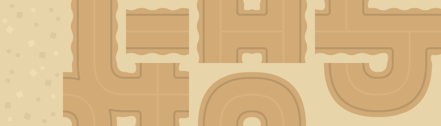
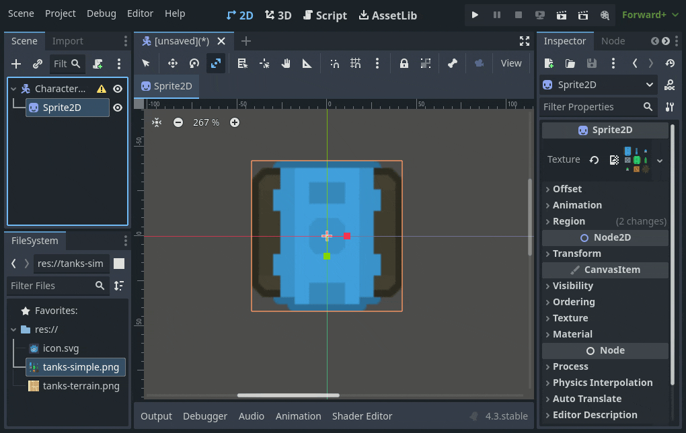
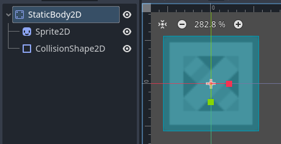
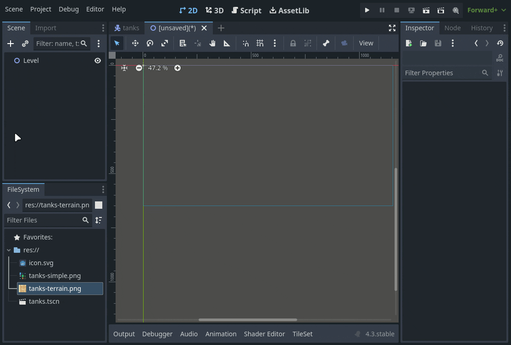
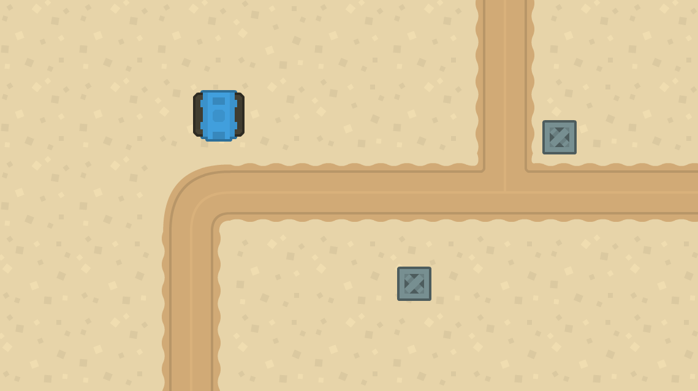
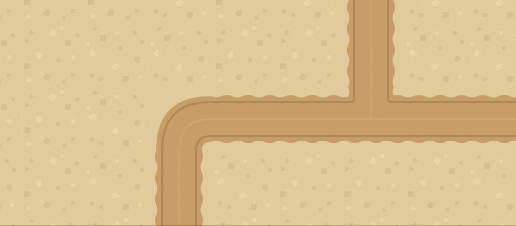

*I dette eksempelet bruker vi [Kenney top-down tanks](https://www.kenney.nl/assets/top-down-tanks-redux) asset pakken. Lagre bildene under for et mindre utvalg fra pakken.*




1. [Oppsett](#oppsett)
2. [Kode](#kode)
3. [Kollisjon](#kollisjon)

# Oppsett

Et triks for å gjøre det mer interesant å jobbe er å unngå å jobbe med grå bokser. Så før vi begynner å programmere, skal vi sette opp en scene med noe grafikk, dette er lurt å gjøre selv om du venter på at de som er ansvarlige for å produsere grafikk, bare bruk noe annet midlertidig, *placeholder-art*.

## Tanks

Vi skal lage en tanks, som er et fysisk objekt som beveger seg. For dette kan vi bruke *CharacterBody2D*


Vi kan bruke *region* parameteret til å velge ut en del av et *sprite sheet* til å bruke som tanksens sprite.


For at karakteren vår skal kunne kolidere i ting må vi ha en *CollisionShape*


Legg til en *CollisionShape2D* og gi den en *Shape* som passer grafikken og juster størrelsen. Husk å gi scenen et navn og lagre den.



Lag en boks på samme måte, men i stedet for *CharacterBody2D* kan du bruke *StaticBody2D*, siden denne ikke skal kunne flyttes på.



Lag så en ny scene som skal være levelen vår. Her kan du dra inn noen bokser og en tanks, og om du ønsker kan du bruke et *TileMapLayer* til å lage en bakgrunn.





Nå har vi en scene som er litt mer interesant som vi kan bruke når vi programmerer.

---

# Kode

Så lenge karakteren vår er en CharacterBody2D, så er alt vi trenger for å bevege den å sette velocity og bruke move_and_slide() i _physics_process(delta) funksjonen. 

```gdscript
extends CharacterBody2D

func _physics_process(delta):
  velocity.x = 300
  move_and_slide()
```


Her setter vi retning basert på piltaster. vi putter det i en Vector2 variabel, den defineres som tom hver gang i starten av funksjonen, slik at karakteren stopper om vi ikke holder inne en tast. til slutt ganger vi retning med fart og gir resultatet til velocity.

```gdscript
velocity = Vector2(move_direction * speed)
```

er det samme som:

```gdscript
velocity.x = move_direction.x * speed
velocity.y = move_direction.y * speed
```

---

```gdscript
var speed = 200
func _physics_process(delta):
  var move_direction = Vector2.ZERO

  if Input.is_action_pressed("ui_right"):
    move_direction.x = 1
  elif Input.is_action_pressed("ui_left"):
    move_direction.x = -1
  elif Input.is_action_pressed("ui_down"):
    move_direction.y = 1
  elif Input.is_action_pressed("ui_up"):
    move_direction.y = -1

  velocity = move_direction * speed
  move_and_slide()
```


I neste eksempel har jeg byttet ut `velocity = Vector2(move_direction * speed)` med kode som bruker move_toward(A,B,C).  

Move toward flytter et objekt gradvis mot et punkt.  

A: punktet den flytter seg fra  

B: punktet den skal til  

C: akselerasjon og brems (ease out/in)  

Om vi og legger til kode som roterer grafikken får vi en ganske naturlig bevegelse.

```gdscript
velocity.x = move_toward(velocity.x, move_direction.x * speed, 5)
velocity.y = move_toward(velocity.y, move_direction.y * speed, 5)
```


om vi ønsker at bilen skal kunne gå diagonalt må vi bare bytte ut elif på linje 10 med if. i forrige eksempel. Det gjør at vi kan ta i mot både vertikal og horisontalt input på samme frame.



---

# Kollisjon
