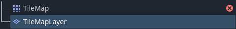
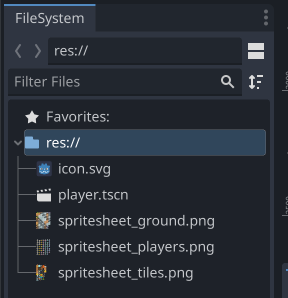
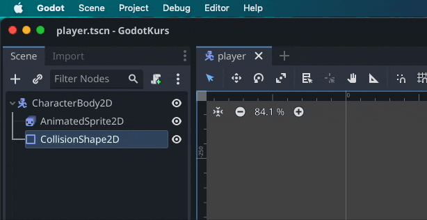
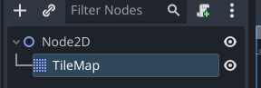
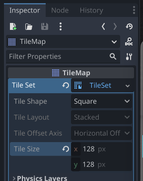
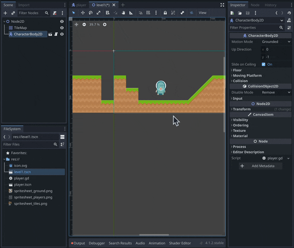
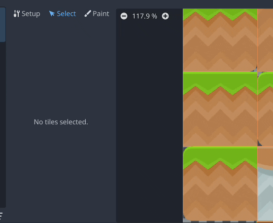

> ⚠️  
> Denne guiden var originalt skrevet for *TileMap*, som nå er utdatert. Vi skal bruke *TileMapLayer* i stedet. Funksjonene vi går gjennom her fungerer likt i begge.
> 
> 

I denne guiden bruker vi [Kenney platformer pack](https://www.kenney.nl/assets/platformer-pack-redux). dra *spritesheet_ground.png* og *spritesheet_tiles.png* inn i FileSystem vinduet.

Vi starter med en ny tom 2D sene.

Start med å legge til en *TileMapLayer* node, og markerer den.

I inspector klikker du på pilen ned ved Tile Set, velger New TileSet og klikker på den når den er lagd. Så setter du Tile Size til å matche størrelsen på tiles-ene i ditt tilesheet. I dette eksempelet bruker vi 128x128 piksler pr tile.

Velg TileSet fanen nederst i vinduet, lag et nytt atlas, og dra kolisjons formspritesheet_ground.png til Texture <empty>. Klikk på Yes når du blir spurt om du automatisk vil lage tiles i det nye atlaset.

*Om du glemte å sette rett oppløsning før du la inn grafikken vil det bli tydelig nå, om tiles ikke matcher rutenettet. Letteste løsningen, slett teksturen fra tileset, fiks oppløsning og importer den igjen.*

Nå kan du velge TileMap fanen og begynne å tegne opp en level med tiles. 

Men, enn så lenge er dette bare visuelt, en karakter vil f.eks falle rett gjennom bakken.

Marker TileMapLayer noden, klikk på TileSet i inspektøren og legg til et nytt element under Physics Layers. Så kan du åpne TileSet fanen og bytte til Select i stedet for Setup.

Herfra kan vi velge en tile, bla ned til Physics og velge det nye laget vi lagde. Du kan trykke på F for å fylle hele tilen med en kollisjonsform. Herfra kan du bruke node verktøyene for å sette opp formen slik at den matcher grafikken.

*Tips: du kan ha flere Physics Layers på samme TileSet med forskjellige collision layers og masks*

Du kan gå på *Debug* og slå på *Visible collision shapes* for å se om du har glemt å legge til kollisjon på noen elementer.

