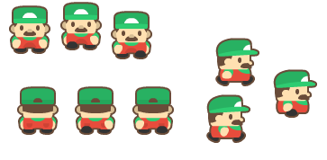
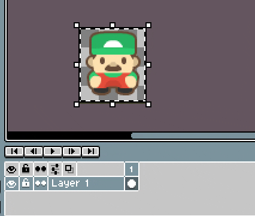
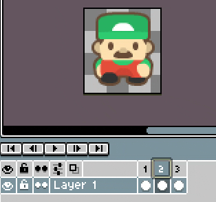
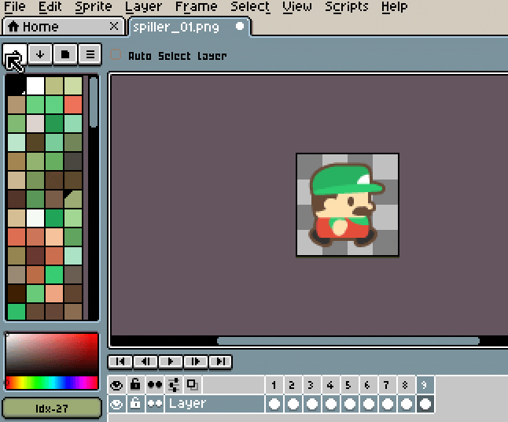

Denne oppgaven består av 2 deler.

## Del 1: sett sammen et Sprite Sheet

Last ned dette bildet:

Deres oppgave er nå å gjøre den klar til programmererne slik at de kan putte karakteren inn i spillet.

I denne øvelsen bruker vi verktøyet [Libresprite](https://libresprite.github.io/#!/downloads).

Start med å åpne bildet du lastet ned, da skal det se omtrent slik ut.

Kjapp gjennomgang av arbeidsområdet. På høyre siden har vi verktøyene våre, på venstre siden er fargepaletten. Nede er tidslinjen til animasjonen. Og nede til høyre har vi en knapp merket **1:1** som åpner forhåndsvisningsvinduet, dette vinduet kan brukes til å vise hele bildet når du jobber zoomet inn, eller spiller av animasjonen du jobber på.

Her har vi en ferdig allt vi trenger for å sette sammen en animasjon, så begynn med å marker ett element, og kopier det. Tips, la det være litt "luft" på sidene.

Lag et nytt dokument. Dimensjonene blir satt automatisk til å matche det du kopierte. Og lim inn.

Bruk **Alt+b** for å lage en ny "frame", og lim inn neste element.

Det viktigste å passe på her er at animasjonen er stabil. Det har ikke jeg fått til her, vi ser karakteren spretter rundt når vi spiller av animasjonen.

Da må vi inn å justere, vi kan bruke "Onionskin" for å hjelpe med å plassere karakteren rett. Vi kan stille det inn til å vise et gjennomsiktig bilde av forrige frame, og bruke Move Tool til å flytte karakteren på plass.

Fortsett slik til alle bildene er brukt i animasjonen.

Da kan vi eksportere animasjonen vår til et spritesheet. Gå til File > Export Sprite Sheet. Før vi eksporterer kan vi gjøre noen instillinger på hvordan vi vil ha Sprite Sheetet satt opp. En tommelfinger-regel er at vi ønsker mest mulig kvadratisk bilde og minst mulig tomrom. Men vi ønsker også at Sprite Sheetet skal være ryddig, og lett å bruke. I dette tilfelle har hver del av animasjonen 3 bilder, så da setter vi Sheet Type til "By Rows" og 3 kolonner. 

Huk av på "Output FIle" og klikk på select file for å velge hva filen skal hete. 

Tips, dersom bildene dine går helt ut til kanten kan det være lurt å legge til "padding", det gjør det mye enklere å dele opp animasjonen i Godot senere.

Da skal vi ende med noe slik:

 

## Del 2: Lag ditt eget sprite sheet

Når du er ferdig med dette kan du gå på [The Spriters Resource](https://www.spriters-resource.com/) for både inspirasjon, og hente ut flere sprites å øve deg med. 

Når du føler at du har kontroll, begynn med å lage ditt eget spritesheet fra grunnen av. 

## Bonus: Videre utforsking

Ta en titt på denne videoen for noen tips til spill animasjon: [ANTICIPATION - The 12 Principles of Animation in Games - YouTube](https://www.youtube.com/watch?app=desktop&v=28s1Hv3Zqlo)

Du kan også gå her [1 - Sprite Animation](https://ensva002.github.io/Godotkurs%202024/pages/1_-_Sprite_Animation.html) og se på hvordan du kan bruke spritesheetet i Godot. Det er en kjempefordel å vite hvordan det blir brukt i spillmotoren når du skal lage egene sprites.

*Du kan bruke andre verktøy enn libresprite, ta gjerne en titt på hvordan du gjør det i f.eks. photoshop, om du er komfortabel med å bruke det.*
