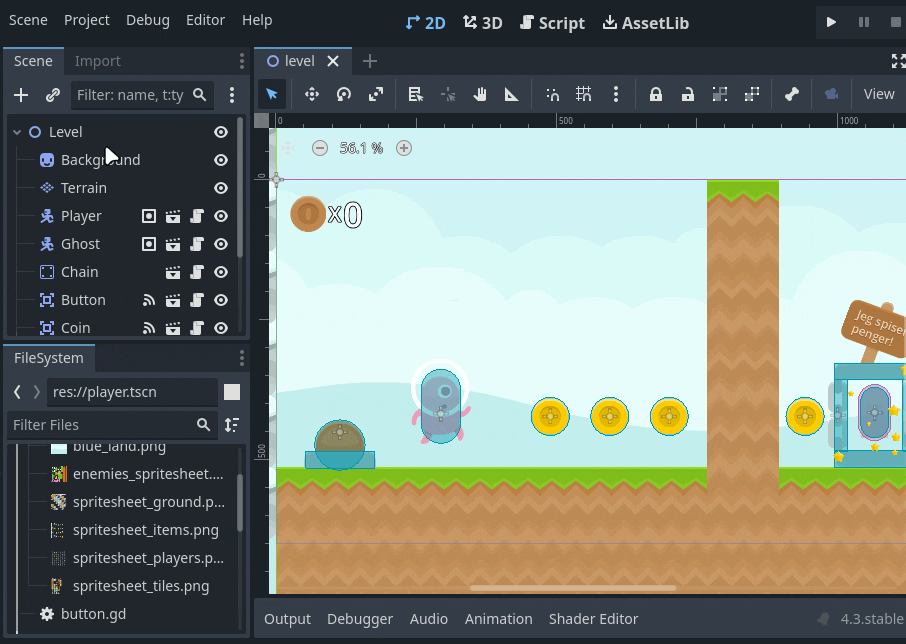
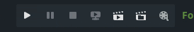
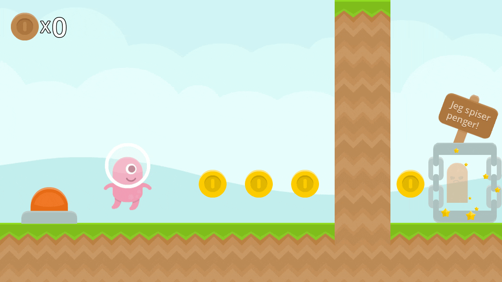

Godot har en innebygd funksjon for å ta opp video. Dette er praktisk når du for eksempel trenger innhold til en trailer for spillet ditt.

## Oppsett

Først må du sette opp hvor videofilen skal ligge og hva den skal hete.

Gå til *Project > Project Settings > Movie Writer* og velg ønsket mappe og navn i *Movie File* feltet. **Obs:** Velg en mappe utenfor spillprosjektet.

På denne skjermen stiller du også inn kvaliteten på videoen.

## Opptak

Så er det bare å slå på *Movie Maker mode* før du starter spillet, så taes det automatisk opp.

Du vil nok merke at spillet kjører tregere og mer hakkete enn vanlig. Dette er fordi godot passer på at hver *frame* blir ferdig rendret før den går videre til neste, når du spiller spill vanlig så kan frames hoppes over for å holde hastigheten oppe. Dette vil si at du kan ta opp en spill video i en mye høyere kvalitet enn det maskinen din klarer å kjøre vanligvis, det tar bare litt lenger tid.

Her tok jeg opp en video med 165fps, det ser kjempe tregt ut, men på den eksporterte videoen går det i rett hastighet.

**Obs:** Når du har en video du er fornøyd med, enten flytt den eller gi den nytt navn, for om du tar opp på nytt så vil den overskrives.

## Fordeler og ulemper

Fordelen er som sagt at du kan spille inn en video med høy kvalitet og framerate på relativt svakt hardware.
Ulempen er at det kan være vanskeligere å spille spillet for å få naturlig "gameplay" å ta opp.
