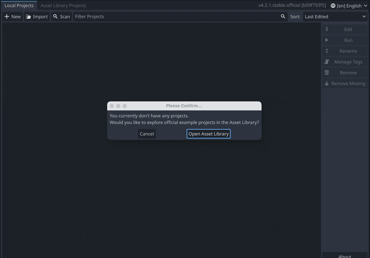
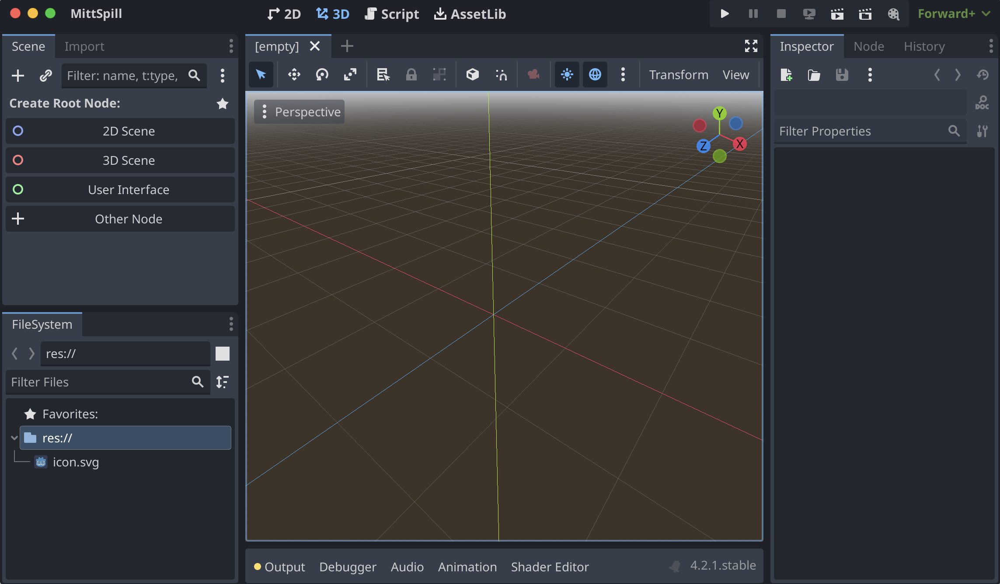

Første gang du starter Godot blir du spurt om du vil åpne *asset biblioteket*, kanseler dette. Så klikker du på knappen oppe til venstre `+ New`, velg mappen du vil ha prosjektet i, så skriver du inn prosjektnavnet og trykker på `Create & Edit`

 

Nå vil du se dette vinduet:

Oppe til venstre ser du `Scene` vinduet, her vil du etterhvert se alle nodene som ligger i senen du jobber på.

Nede til venstre ser du `File System`. Her vises alle prosjektfilene dine, alle filer som ligger i samme mappe som prosjektet.

Helt til høyre ser du `Inspector`. Her vil du se alle egenskapene du kan endre på når du har valgt en node. F.eks. possisjon, størrelse, hvilke tekstur den bruker hvilken lyd den spiller av osv osv.

I midten ser du virewporten din. Nå viser den en tom 3D scene, du kan bytte mellom hva som vises med knappene helt øverst i Godot vinduet: `2D` `3D` og `Script`. På toppen av viewporten er det en rad med verktøy, denne er dynamisk slik at verktøyene byttes ut bassert på hva du driver med. Men her er de du kommer til å bruke mest:

Legg merke til at noden som heter "Icon" blir valgt, det er noden som er valgt i `Scene` som blir påvirket av verktøyene.

For å flytte deg rundt i viewporten kan du klikke med musehjulet og dra eller holde inne mellomromstasten og dra. Om du bruker touchpad kan du dra med to fingre.

Den tynne blå ruten du ser er spillets "kamera" alt som spiller skal se må være innenfor denne ruten.

Nå kan du gå videre til [1 - Sprite Animation](1_-_Sprite_Animation.html)