Vi begynner med en enkel animasjon så vi har en karakter å bruke gjennom resten av guidene. 
Last ned dette spritesheetet for å følge guiden:
[Spritesheet TODO: Ny Link](https://udeoslokommuneno-my.sharepoint.com/:i:/g/personal/ensva002_osloskolen_no/EQJEMfZfyhxEsahnFmAknOABOyzP1ygvjZqiBGQP29KoPA?e=8uoi9g)

Begynn med å dra spritesheetet inn i "FileSystem" vinduet i godot, som standard befinner det seg nederst til venstre.

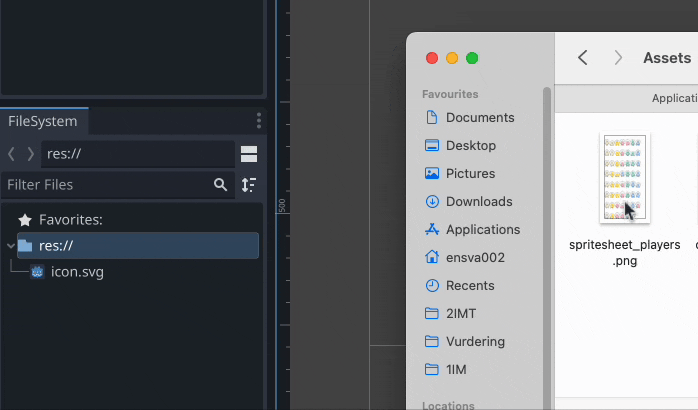

//Om du høyreklikker hvor som helst i FileSystem vinduet kan du velge "Open in File Manager", da vil Finder åpne mappen til prosjektet.
Så lager vi en ny sene. Vi skal lage en karakter, så da kan vi velge Other Node og finne CharacterBody2D. Hint: alle 2D noder er blå, 3D noder er rød og GUI er grønn. Det er også noen noder som ikke passer til noen av kategoriene(hvite), eller dekker fler kategorier(flerfarget).

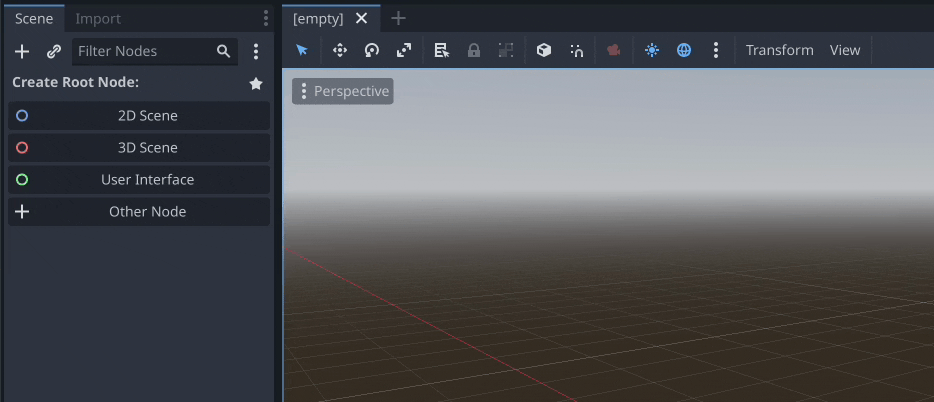

Punktet der den røde og grønne linjen møtes er "origin" midtpunktet til karakteren. Etterhvert som vi legger til noder må vi passe på at vi holder oss til sentrum av karakteren. Vi ser og om vi markerer CharacterBody2D så markeres punktet den befinner seg i scenen. som skal være midt på.

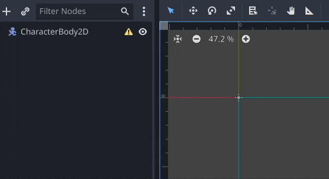

Marker CharacterBody2D ved å klikke på den, klikk så på + oppe i venstre hjørnet og finn AnimatedSprite2D. Den skal nå ligge under CharacterBody2D.

Med AnimatedSprite2D valgt, gå til Inspector, vanligvis på høyre side, åpne Animation og klikk på pilen ved Sprite Frames og velg New SpriteFrames for å lage en ny sprite frame resurs. Klikk så på den nye sprite frame resursen.

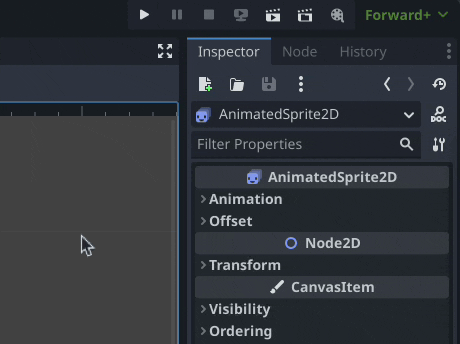

Nå skal SpriteFrames fanen ha åpnet seg nede på skjermen. Her kan vi lage alle animasjonene til karakteren vår. Klikk på knappen med et lite rutenett for å legge til nye bilder til animasjonen, velg filen vi lastet ned i starten og juster parameterene oppe i høyre hjørnet slik at rutenettet passer karakterene. i dette tilfellet vil vi ha 8 x 8. Velg to bilder fra en løpe animasjon og klikk på Add Frames. De to bildene vil legge seg inn i animasjonen. over dem ser du knapper for å kontrolere avspillingen av animasjonen. Vi vil at animasjonen skal loope så pass på at de looping er på (blå = på, hvit = av). det er de to pilene som peker i sirkel til venstre for FPS.

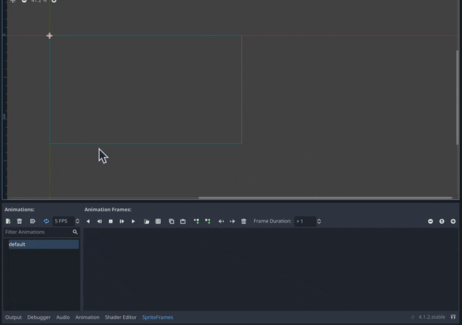

Dobbeltklikk på animasjonsnavnet, det heter nå "default" og gi den et nytt navn, som "run". Animasjonene bør ha korte og forklarende navn så vi lett kan referere til dem i koden vår senere.
klikk på arket med en + på for å lage en ny animasjon.

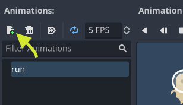

De neste to animasjonene skal bare ha 1 frame, så de er ikke mye til animasjon, men ved å lage dem som animasjoner gjør det lett for oss senere å bytte mellom dem med relativt lite kode. Lag disse på samme måte til du har disse tre animasjonene:

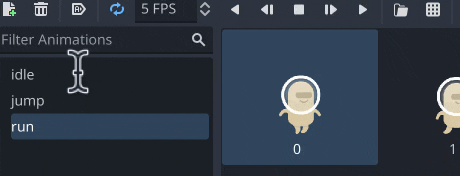

Da er vi ferdig med animasjonene, det er bare to små justeringer igjen før vi kan bruke den i spillet vårt.
Først, vi ønsker at karakteren skal være så nær sentrum som mulig, så vi flytter AnimatedSprite2D høyere opp. pass på at du har AnimatedSprite valgt og ikke CharacterBody2D, det er kun grafikken vi ønsker å flytte. 

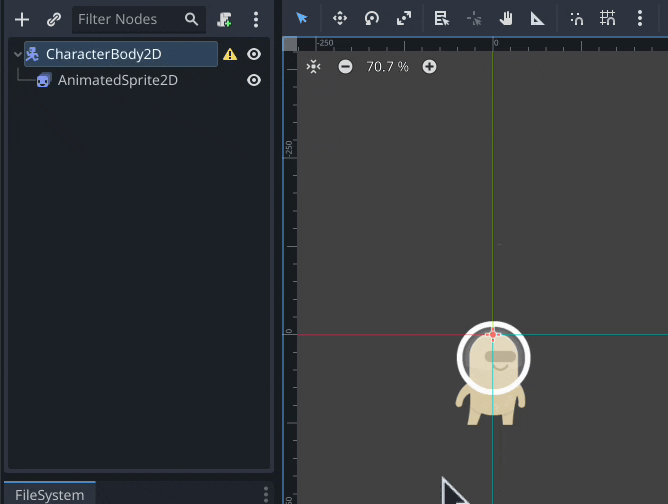

Om du ved et uhell har flyttet CharacterBody2D i stedet marker den igjen, gå til inspektoren og reset possisjon under Transform.

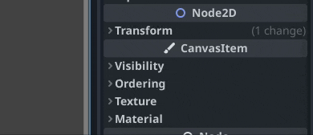

Varseltrekanten advarer oss om at CharacterBody2D ikke har en "shape". Det finnes flere bodies, som StaticBody og RigidBody, og alle Bodies trenger en shape som skal brukes til kollisjoner og fysikk. Marker CharacterBody2D, klikk på + og velg CollisionShape2D. Sene treet ditt skal nå se slik ut.

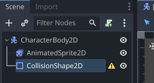

Så går vi til Inspector igjen klikk på pilen ved Shape og velg new CapsuleShape2D. Så juster den sånn at den røflig passer karakteren vår. Denne bestemmer hvor kolisjoner skjer med karakteren, med bakken, fiender, osv.

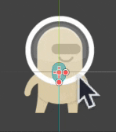

Så er det bare å lagre karakteren vår med cmd+s. Og gi den et navn, f.eks. player.tscn

Her kan du laste ned prosjektfilen for denne delen:
[Prosjektfiler TODO: Ny Link](https://udeoslokommuneno-my.sharepoint.com/:u:/g/personal/ensva002_osloskolen_no/EQzrZE4YGwhKq6H8rIfId-wB85uFd7YCHRI3lHvvZoXULQ?e=0qiFoY)

