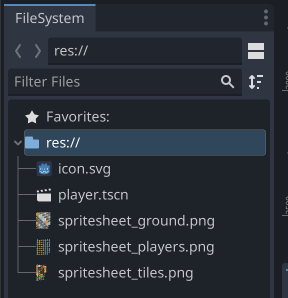
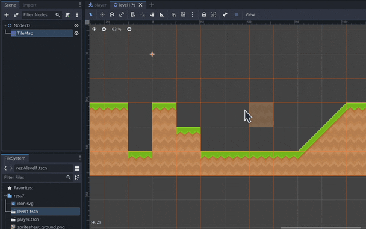
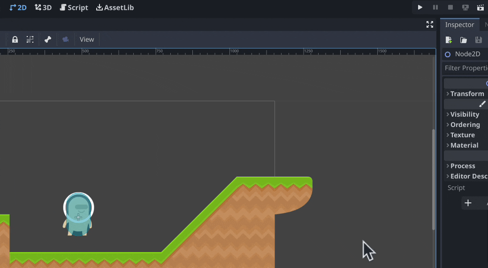
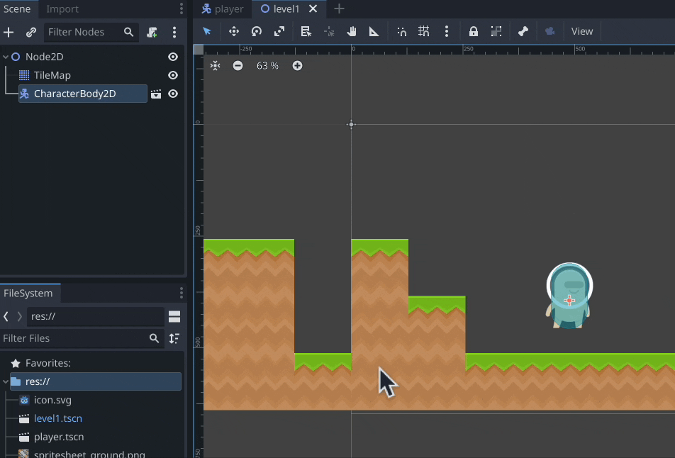
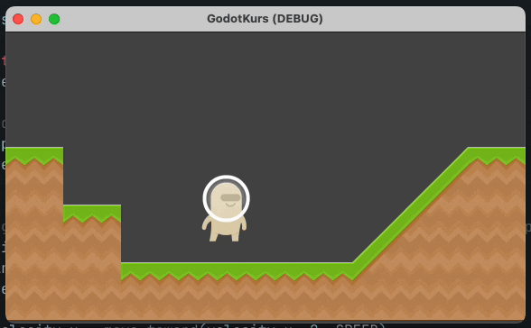
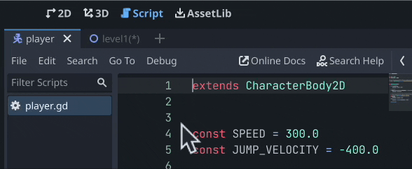
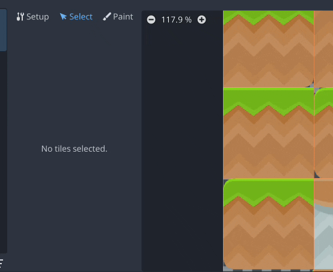

Nå skal vi lage en level som vi kan putte karakteren vår inn i.
Vi fortsetter med [Kenney platformer pack](https://www.kenney.nl/assets/platformer-pack-redux), som vi gjorde i forrige seksjon. dra *spritesheet_ground.png* og *spritesheet_tiles.png* inn i FileSystem vinduet.

Vi starter med en ny tom 2D sene. Her velger vi å starte med en 2D node, dette er en grunnlegende node med relativt få atributter. Vi starter med denne ettersom denne scenen skal ha flere scener i seg og denne egner seg godt som en rot-node.

Start med å legge til en TileMap node, og markerer den.

I inspector klikker du på pilen ned ved Tile Set, velger New TileSet og klikker på den når den er lagd. Så setter du Tile Size til å matche størrelsen på tiles-ene i ditt tilesheet. I dette eksempelet bruker vi 128x128 piksler pr tile.

Velg TileSet fanen nederst i vinduet, lag et nytt atlas, og dra spritesheet_ground.png til Texture <empty>. Klikk på Yes når du blir spurt om du automatisk vil lage tiles i det nye atlasset.

Nå kan du velge TileMap fanen og begynne å tegne opp en level med tiles.  Lag en bakken stor nok til at karakteren din kan løpe litt frem og tilbake.

Lagre senen som f.eks level1.tscn. Marker Node2D, og dra spilleren vi lagde i del 1 inn i scenen. Pass på at du slipper den innenfor den blå firkanten, enn så lenge så er dette alt vi kan se når vi kjører spillet.

Vi kan nå kjøre vår første test av spillet. Klikk på Play øverst i høyre i godot vinduet, og klikk på Select Curent for å sette denne senen som hoved senen. hovedsenen er den som starter når man starter spillet, og er markert med blått i FileSystem vinduet. Du kan endre dette senere ved å høyreklikke på en annen sene og velge Set As Main Scene.

Spillet er helt statisk nå, så det er på tide å begynne å legge til kode. Åpne spiller senen, velg CharacterBody2D og klikk på arket med en + for å knytte et script til karakteren. Her kan du lage et nytt script, pass på å gi et navn til scriptet ditt hvor all teksten under er grønn. Det betyr at du ikke har navngitt scriptet ditt noe som er holdt av for Godot. Når du lager et script på denne måten med en CharacterBody2D får du et ferdiglaget eksempelscript til en 2D platformer karakter.

Om vi tester spillet vårt igjen nå kan vi se at karakteren har fått fysikk, men, siden vi ikke har gitt en kollisjonsboks til bakken, slik som vi gjorde med spiller-karakteren faller den rett gjennom bakken.

Begynn med å bytte tilbake til level1 og gå ut av script view til 2D view.

Marker TileMap, klikk på TIleSet i Inspector og legg til et nytt element under Physics Layers. Så kan du åpne TileSet fanen og bytte til Select i stedet for Setup.

Herfra kan vi velge en tile, bla ned til Physics og velge det nye laget vi lagde. Du kan trykke på F for å fylle hele tilen med en kolisjonsform. Herfra kan du bruke node verktøyene for å sette opp formen slik at den matcher grafikken.

Nå kan vi teste spillet igjen, og bevege karakteren med piltastene og mellomromstasten. Tips, du kan gå på Debug og slå på Visible collision shapes for å se om du har glemt å legge til kolisjon på noen elementer.

Men hvor er alle animasjonene vi lagde i del 1? Spillet vet ikke når disse skal spilles av enda, det skal vi se på i del 3!

Husk at du kan ta en titt på eksempel prosjektet som er linket til under resurser!

