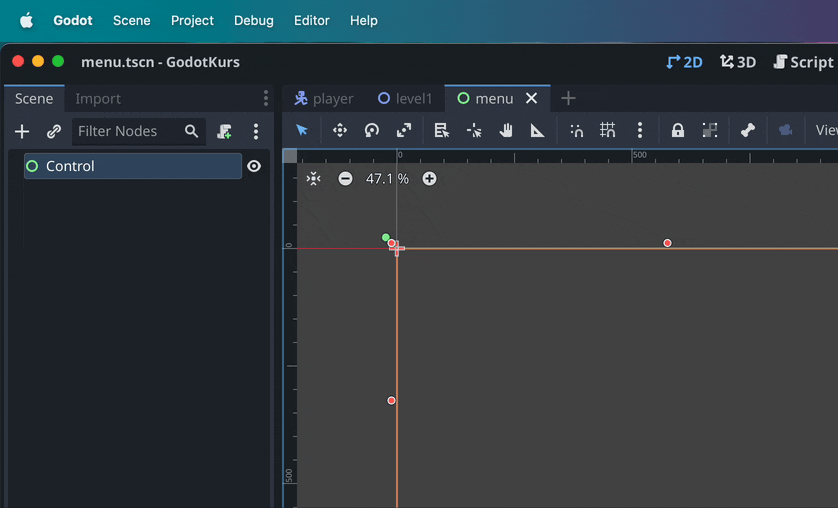
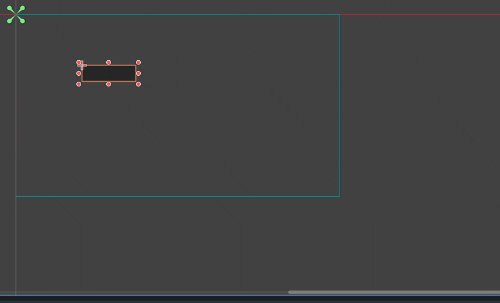
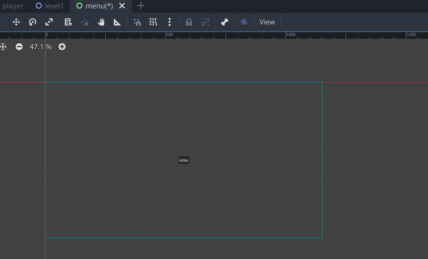
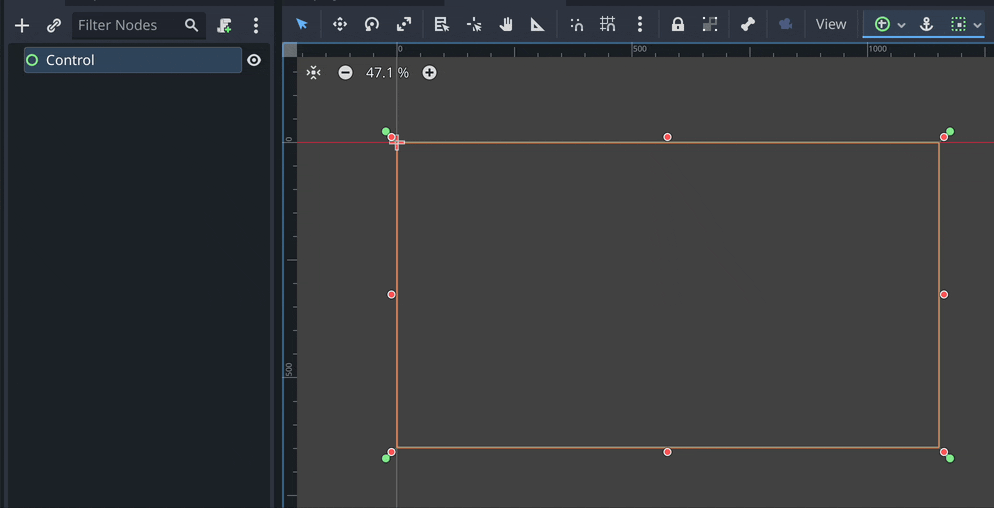
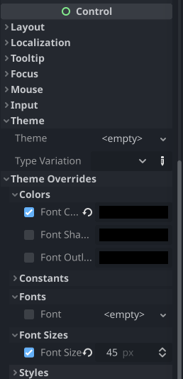

For å lage en GUI sene bruker vi Control noden. I disse eksemplene bruker jeg knapper, men alle de "grønne nodene" oppfører seg på samme viset.

Disse grønne "nålene" er anker. Hvert element har fire stykker, og hvert hjørne i elementet er ankret en fast avstand fra sitt anker. Så står alle fire oppe i et hjørne vil elementet alltid være like langt fra det hjørnet uansett hvor stort vinduet er. Er ankrene i hvert sitt hjørne vil elementet forandre størrelse slik at hvert hjørne får beholde sin faste avstand fra ankeret. I utgangspunktet blir ikke elementer mindre enn at de kan vise innholdet sitt.

Når du har en Control node valgt, så dukker det opp et par nye verktøy på verktøylinjen. Den grønne sirkelen med et kryss i er en liste med predefinerte posisjoner. Ankeret kan slås av og på, om det er på (blått) så følger ankrene med når du flytter på elementet.

Konteinere kan brukes til å samle elementer på et ordnet vis. Husk å ta en titt på Inspector-en det er mange innstillinger for å designe GUIen akkurat slik du vil ha den.

For å forandre på utseendet til elementene må du ha et theme, disse er svert fleksible men kan være noe tidkrevende å lage. trenger du å gjøre noen raske små justeringer kan du bruke theme overrides.

Hvordan vi får knappene til å fungere skal vi se på i neste del, signaler
