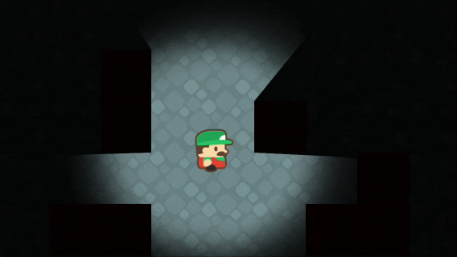
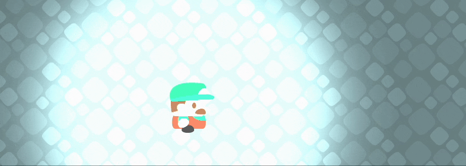
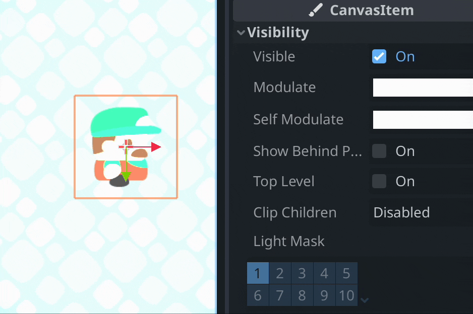
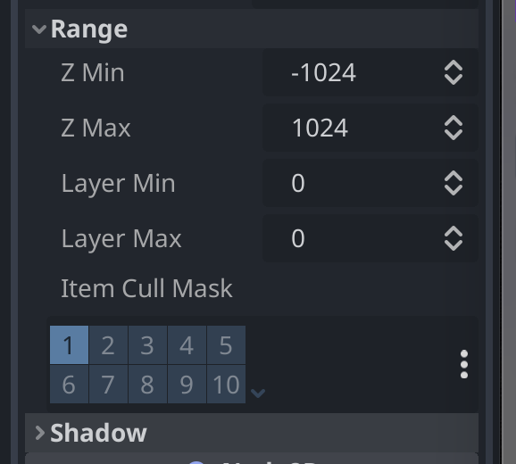

Guide er ikke ferdig skrevet enda, men ta en titt på nyeste version av eksempel prosjektet, Lys og Skygge eksempelet ligger i Lighting mappen

*I dette eksempelet bruker vi [Kenney Sokoban](https://www.kenney.nl/assets/sokoban) asset pakken.*

Her skal vi bruke noden PointLight2D, denne noden bruker en tekstur til å lyse opp elementer i samme Cull Maske (vi kommer tilbake til dette lenger ned i guiden.)
Først må vi begynne med en bakgrunn som kan lyses opp, PointLight2D kan ikke lyse opp den grå bakgrunnen til Godot. I eksempelet bruker jeg en TileMap. Legg så til en PointLight2D node og legg light.png på tekstur atributtet light.png på tekstur feltet. 

Så kan vi legge inn karakteren vår, ta gjerne en titt på eksempel prosjektet eller tidligere guider om du er usikker på hvordan du lager en karakter. Legg PointLight2D på karakteren slik at lyset er rundt den.

Vi ønsker nødvendigvis ikke at karakteren selv blir lyst opp, det kan vi unngå ved å bytte hvilket Light Mask lag AnimatedSprite2D ligger på. Dette kan du gjøre med nesten alle noder for å kontrolere hva de blir opplyst av, det ligger under Visibility.

Disse lagene tilsvarer Item Cull Mask under Range i PointLight2D. Om du markerer 1 2 og 3, vil det lyse opp noder med light mask 1 2 eller 3. Så om vi slår av alle Light Mask lagene på spiller spriten, vil ingen lys kunne lyse opp spilleren. VI skal se mer på hvordan vi bruker disse lagene i del 9 - ⏳ Timer.

Vi kan justere hvor mørke elementer skal være Modulate atributtet, så om vi vil at spilleren skal befinne seg i et bekmørkt rom må vi velge bakgrunnsnoden gå under CanvasItem og visibility, og velge en mørk farge på Modulate. Om det blir for mørkt i lyset kan vi gå på PointLight2D og sette opp Energy. 

