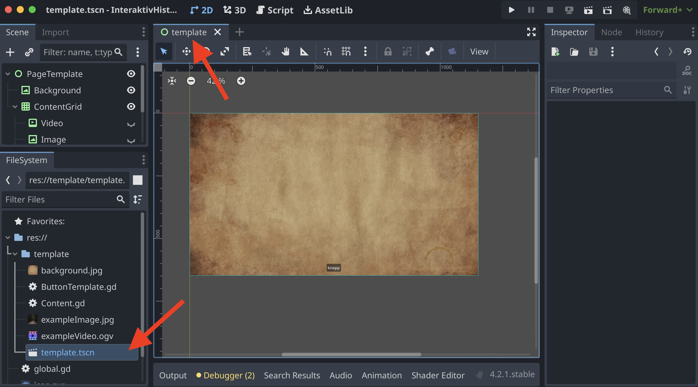
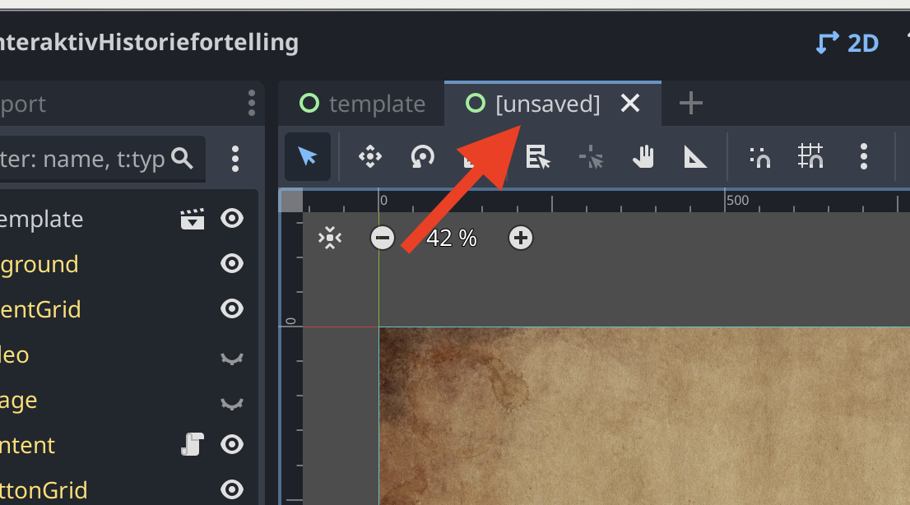
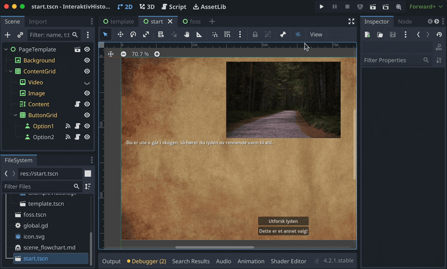
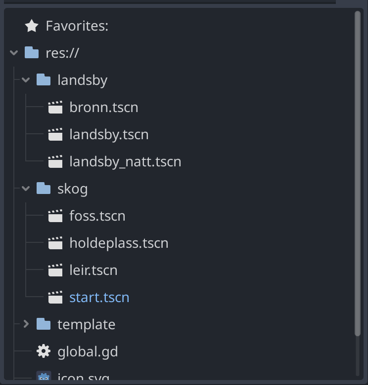
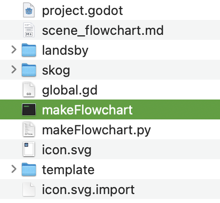
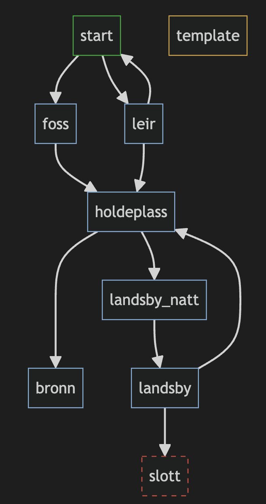
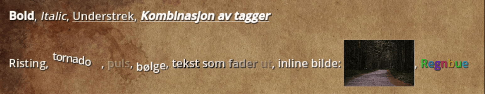

For å komme i gang med å lage en interaktiv historie i Godot kan du bruke denne malen:

Når du åpner prosjektet i Godot, har du en mappe som heter *template* åpne den og åpne senen. *(sener har .tscn som filending)*

Du åpner den ved å dobbeltklikke, så ser du at en fane med samme nav dukker opp i toppen av vinduet. Du skal ikke skrive historien din her, denne fungerer som en mal for hvordan oppsettet til senene dine skal se ut.

For å lage en ny sene, høyreklikk på template, og velg "New inherited Scene".

Den dukker opp som en ny fane, lurt å lagre den med en gang. *(cmd + s)*. I denne senen kan du begynne å lage historien din. Elementene i senen, nodene, ser du til venstre av vinduet. Klikk på dem for å forandre på innholdet. Du kan legge til flere noder om du ønsker det, for eksempel flere bilder. For å legge til flere valg, pass på å duplisere *Option1* knappen.

Sett senen du ønsker å starte i til hovedsene ved å høyreklikke på den og velg "Set as Main Scene"

For at spilleren skal kunne gå til andre sener, må du legge til en link i knappene. Dette kan du gjøre ved å dra en av sene-filene dine over i *Scene Path* feltet på knappen. For å teste spillet, klikk på *play* knappen øverst i vinduet. For å teste fra senen du redigerer på, klikk på filmklapperen med et *play* ikon i seg.

Ved å redigere på *template.tscn* kan du forandre på utseenet til historien din. Etter at du har gjort forandringer, og lagret senen, så oppdaterer alle de andre senene seg til å matche den. Individuelle endringer du gjør på andre sener blir ikke overskrevet, så du kan f.eks ha en egen bakgrunn på enkelte sener.

# Tips

husk å ha orden i filene dine. Dersom du flytter en fil etter at den er blitt linket til, så kan linken bli brutt og må settes på nytt.

For å få en oversikt over senene dine kan du kjøre "makeFlowchart" som ligger i prosjekt filene til template prosjektet.

Den generer en fil som heter *scene_flowchart.md*. Åpne denne med en markdown leser som støtter *mermaid*, for eksempel [MarkText](https://www.marktext.cc), eller i VS Code med en [mermaid extension](https://open-vsx.org/extension/bierner/markdown-mermaid)

- Grønn ramme = hoved senen

- Gul ramme = sene som ikke blir linket til

- Rød stiplet ramme = Link til sene er brutt

I dette eksempelet ser vi at linken til senen som heter slott er brutt, det kan skje om du blant annet har gitt senen nytt navn, flyttet den til en annen mappe eller slettet den.

## BBCode

Noden som er satt opp i malen støtter BBCode som kan brukes til styling. det fungerer veldig likt html tagger. [b]denne teksten blir bold[/b]. Ta en titt i [Godot dokumentasjonen](https://docs.godotengine.org/en/stable/tutorials/ui/bbcode_in_richtextlabel.html#reference) for å se hvordan det kan brukes.
